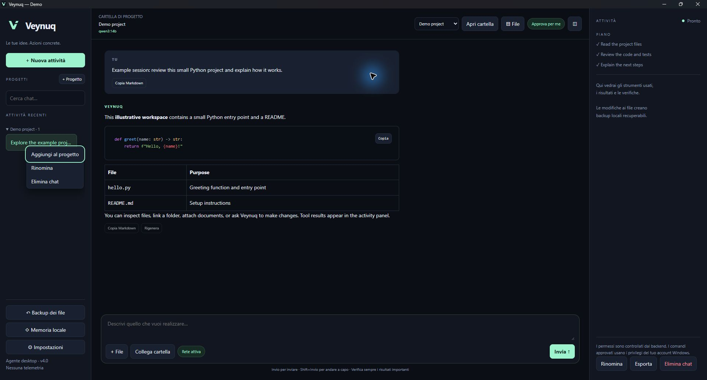
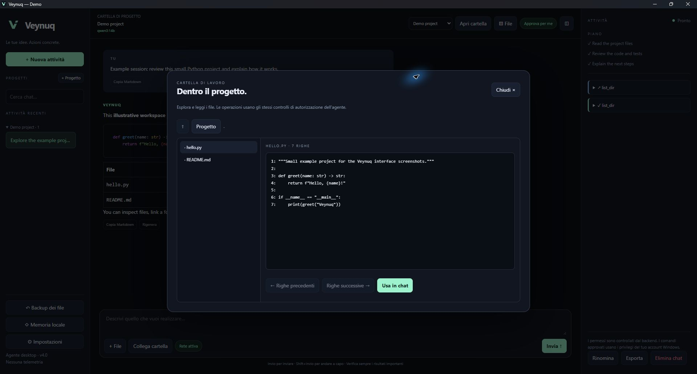
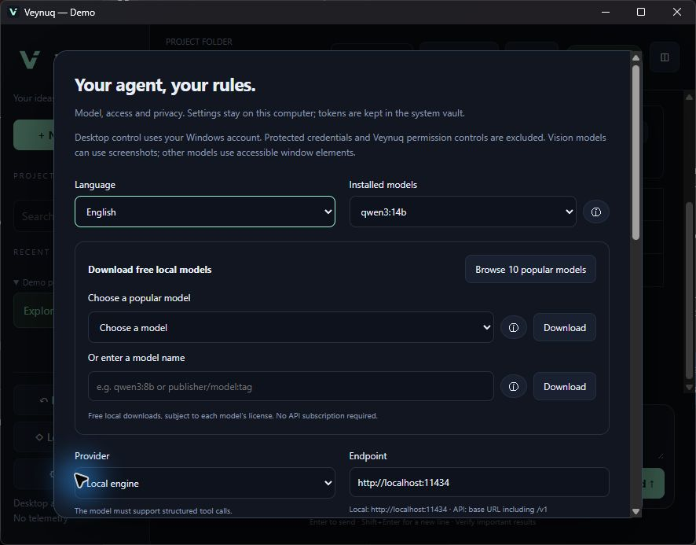

# Veynuq


Veynuq (pronounced “VAY-nook”) is an independent Windows desktop AI agent. It works with local models or a Chat Completions compatible API, and uses backend tools to act on files, projects, GitHub, the web and accessible Windows applications.

## See Veynuq

Three screenshots of the running Windows application with an isolated demo profile. The illustrative conversation contains no personal chat or credentials and is not a benchmark.

**Workspace and conversation** — both user and agent messages are aligned left; the composer stays visible while history scrolls.



**Project explorer** — browse folders, read real files and refer to them in chat.



**Models and settings** — installed models, the ten-model download selector, custom names and information beside each model. Permissions and provider credentials are further down the same panel.



The [brand assets](assets/brand) include original [dark](assets/brand/logo-dark.svg) and [light](assets/brand/logo-light.svg) SVG/PNG logos and a Windows icon. The Desktop shortcut uses the dark icon.

## What it does

The backend owns the model → tool → result loop. Markdown code fences never execute commands. Actions use validated structured tool calls, and failures return the actual error/output to the model for correction.

- **Code and projects:** read/search/write/edit files, run PowerShell commands and tests, inspect Git, clone public repositories and configure their dependencies. Commands report exit codes; shell directory changes persist across commands and restarts.
- **Files and documents:** create folders, move/delete individual files with recoverable backups, preview files, extract PDF/DOCX text, attach files with bounded text excerpts, and link folders.
- **Windows applications:** list visible windows, inspect accessible controls, click, type literal text and send shortcuts. Actions use a short-lived observation and must re-inspect afterwards. Vision-capable models can receive requested window screenshots; other models use the accessibility tree.
- **Online and GitHub:** DuckDuckGo search with Bing fallback, public URL reading, and GitHub REST reads/writes for any requested repository. The configured repository is an optional default, not a restriction. GitHub itself enforces the token’s permissions.
- **Conversation:** projects with accordion groups, full-text chat search, rename/delete/export, persistent editable memory, paginated access to other chats in the same project, Markdown tables/lists/highlighting, copy and regeneration.
- **During a run:** live text and colored tool logs, task plans, targeted questions, queued follow-ups, and Stop when the composer is empty. Stopping preserves partial text and completed actions.
- **Models:** installed-model dropdown, a ten-family catalog, custom-name download, progress/cancellation, deletion, source links and approximate RAM/VRAM/size/use-case details.
- **Distribution:** tested main-branch pushes create signed GitHub Releases; managed installations download and apply updates automatically when idle.

All 58 requirements supplied for this project are mapped to implementations or modern equivalents in [the requirement matrix](docs/REQUIREMENTS.md). Later requirements override the original generic icon and legacy branding/configuration names.

## Install and launch

Windows 10/11 and Python 3.11+ are required. A tool-capable local model is sufficient; a paid API is optional.

1. Download `veyq-update.zip` from [the latest release](https://github.com/gabriele-gaudissard/Veynuq-Agent-App/releases/latest).
2. Extract it to a writable application folder outside your working projects.
3. Run `Installer.bat`. It creates a virtual environment, installs dependencies, registers updates and creates the Veynuq Desktop shortcut.
4. Launch Veynuq. A new profile starts in **English**. Choose a 7B, 8B or 14B starter model, another catalog model, an installed model, or a remote API.

Model downloads require your explicit choice. If the default local engine is missing, the confirmed download starts the official installer, verifies its Windows publisher signature and starts the engine. An already running engine is reused. Installer failures preserve the application and are reported. Engine installation requires network access and a valid publisher signature; this path is not needed on an already configured PC.

`Installer_only_shortcut.bat` repairs the Desktop and Start menu shortcuts with the dark seven-size Windows icon. The installer verifies that the icon exists. The shortcut launches without a terminal window. `Veynuq.bat` also launches the app; opening a batch file directly may briefly show its shell. Missing Python packages are repaired automatically on launch, with diagnostics in `startup.log`.

Settings includes a visible selector for 10 popular free local model families, a custom model-name download field and an information button beside each model. Details distinguish catalog estimates from live installed metadata, including parameters, quantization, maximum context, license, native tools, images and estimated hardware fit. Popular families are curated rather than presented as an unverified global usage ranking. Models without native tool support serve chat and analysis; choose Qwen3 or another tool-capable model for autonomous work.

You can switch existing chats while an agent works and return to the partial response. One run executes at a time; the composer offers a return button when you view another chat. The chat menu includes **Add to project**, with a project picker.

The local protocol uses `/api/chat`, `/api/tags`, `/api/show`, `/api/pull` and `/api/delete`. Compatible APIs use `/chat/completions` and `/models`; include `/v1` where required. Remote endpoints require HTTPS and online access. Local unauthenticated endpoints need no token. Remote vision input is an explicit setting.

The catalog contains curated popular families, not a measured popularity or performance ranking. Hardware figures assume typical quantized weights and are estimates: context, quantization and GPU offloading change requirements. CPU-only inference works but can be slow. Models without native tools work as chat models; select a tool-capable model for autonomous actions.

## Language, follow-ups and optional limits

English, Italian, Spanish and French apply immediately and persist across restarts. The model receives the selected response language. Model-generated prose, filenames, source code and raw operating-system/tool output are preserved rather than translated by the UI.

Type while the agent works to send a **follow-up**. It is queued until the current tool batch has completed, keeping tool/result pairing valid. Leave the composer empty to **Stop**. Regeneration removes later chat messages but does not undo previously executed actions; inspect the result before repeating work.

**Maximum steps: `0` means unlimited. Command timeout: `0` disables the command timeout.** New profiles default to both disabled. You can enable finite values in Settings. Stop, window-close cleanup, output-size validation and repeated-identical-action protection remain active. Network transports retain connection/read timeouts so unavailable services do not hang forever.

## Approval modes

| Mode | Behavior |
| --- | --- |
| Always ask | Each action tool requires one explicit approval; asking an essential question itself does not need a second approval. |
| Approve for me | Project file reads/changes proceed automatically. Commands, desktop control, outside-project access, deletions, memory writes, other-chat context, online requests and GitHub writes require approval. |
| Full access | Actions proceed without confirmations, subject to validation and the online switch. Enabling it requires an explicit checkbox. |

These are application permission gates, **not an OS sandbox**. Shell commands run as the current Windows user and can access other files and network services. Structured file tools protect recognized credential locations and the app data folder, but arbitrary approved shell commands cannot provide the same isolation. Full access does not elevate Windows privileges. GUI controls in password-manager/system-security apps and Veynuq’s own permission UI are protected; inaccessible or elevated applications may require a different approach.

Approval is tied to one action and exact parameters. File changes while approval is pending invalidate it. Denials are returned to the model and recorded. Configuration/project mutations are blocked during work; follow-ups and question answers remain available. Stop interrupts the model connection and terminates command process trees. A window-close handler performs the same cleanup even with command timeouts disabled. Completed side effects remain applied.

## GitHub and updates

The GitHub tool accepts `repository: "owner/name"` for each action. Settings can hold an optional default. A token is only necessary for private data and authenticated writes; use a fine-grained token with the permissions you need. It stays in the backend vault and is injected into requests. Git credential-manager authentication for command-line Git is separate.

Pushing changes to **main** runs Windows backend tests, UI tests and syntax checks before publishing a release. An unpushed local edit or another branch does not update users. Installed packages check at startup and hourly, stage the new version and restart when idle. This independent update check contacts GitHub even if the agent’s online tools are off; disable automatic updates too when avoiding outbound traffic. Explicit model downloads and engine setup also contact their publishers after confirmation.

Every update manifest is **Ed25519 signed** against a pinned publisher key, checked before staging and again before applying. The updater verifies SHA-256 hashes, rejects unsigned/tampered manifests, archive traversal/links and older release sequences, preserves user data, backs up app files and rolls back a failed installation. Changed dependencies install into a separate runtime before switching. Offline/download/rate-limit failures leave the current app installed.

The update publisher is `gabriele-gaudissard/Veynuq-Agent-App`; this fixed trust source is independent of the repositories the agent works on. The signing private key is an Actions secret, with a publisher backup in the Windows vault, and is never distributed. The package signature is not a Windows Authenticode certificate.

Developer checkouts with `.git` use Git updates and are never overwritten by the package updater. Modified managed app files also pause updates to preserve changes. Users of the original application install this version once because the original has no updater. Earlier Veyq packages also require a one-time installation of this renamed release: their updater trusts the old repository URL and file list. Subsequent Veynuq releases update automatically.

## Privacy and recovery

Data defaults to `%LOCALAPPDATA%\Veynuq`, with `VEYNUQ_DATA_DIR` and the legacy `VEYQ_DATA_DIR` overrides supported. Existing Veyq profiles are reused. Installation records the physical profile path in local `profile.json` so Windows filesystem redirection does not create separate profiles for different launchers. This machine-specific file is preserved during updates and is never distributed. Legacy `codex_data.json` is imported once, retaining chats/projects/preferences and migrating the provider token into the vault. The legacy token field is scrubbed after vault storage succeeds.

Chats, settings, memory and backups are local plaintext files protected by the Windows account. Tokens are separately encrypted with current-user DPAPI. The metadata-only audit log records tool names/outcomes/digests, not chat contents. There are no analytics, external fonts or runtime CDN scripts; Markdown/highlight/sanitizer libraries ship locally with licenses. A remote provider receives the context and, when enabled/requested, screenshots needed for the task.

Corrupt JSON is preserved under a separate filename. The app restores the previous valid snapshot, or creates a clean profile if no valid snapshot exists, and displays a recovery notice. Recognized token patterns/configured credentials are redacted from output and logs; this is not a universal secret detector. Structured web tools block private/reserved network addresses and validate DNS/redirects. Missing Beautiful Soup disables web extraction/search rather than crashing the whole app.

## Development and validation

```powershell
python -m pip install -r requirements.txt
python -m unittest discover -s tests -v
python -m compileall -q app.py veyq
npm ci
npm test
node --check app.js
python app.py --self-check
```

Tests cover approval denial, process cancellation/timeouts, persistent cwd, memory/project scoping, follow-up ordering, questions, partial HTTP cancellation, recovery, credential paths, Markdown sanitation, four-language switching, signed updates and rollback. A live `qwen3:14b` run cloned `octocat/Hello-World`, corrected its README filename assumption, wrote a validation script and ran it successfully with Python. GUI observation/action validation is unit-tested with controlled doubles; visual QA covers the real Veynuq app. The missing-engine installer path is checked structurally and with mocks because the development PC already has the engine; no unnecessary reinstall or multi-GB model download was performed.

The agent’s ability to finish a particular task still depends on the model, available tools, hardware, permissions and service responses. It does not guarantee frontier-model quality or successful control of every Windows application. There is no generic MCP/plugin manager, voice/video generator or unattended scheduler in this release.

Publisher builds use `scripts/build_release.py`, the Actions signing secret and the workflow run number. Keep the private key out of source, arguments and ordinary JSON. Startup diagnostics are in the profile’s `startup.log`.

## Name and licenses

The user-selected name is **Veynuq**. Public searches on 8 October 2026 found no exact software brand, GitHub repository, npm/PyPI package or Apple app under this name. Its .com and .app RDAP lookups returned no registration record at that time. Interactive trademark databases were not fully searchable, so this is a preliminary name screen, not legal clearance or a guarantee of exclusivity. Mandatory third-party licenses/attribution remain in [THIRD_PARTY_NOTICES.md](THIRD_PARTY_NOTICES.md) and [LICENSE](LICENSE). Internal compatibility paths retain older identifiers to preserve installed profiles and update trust.
